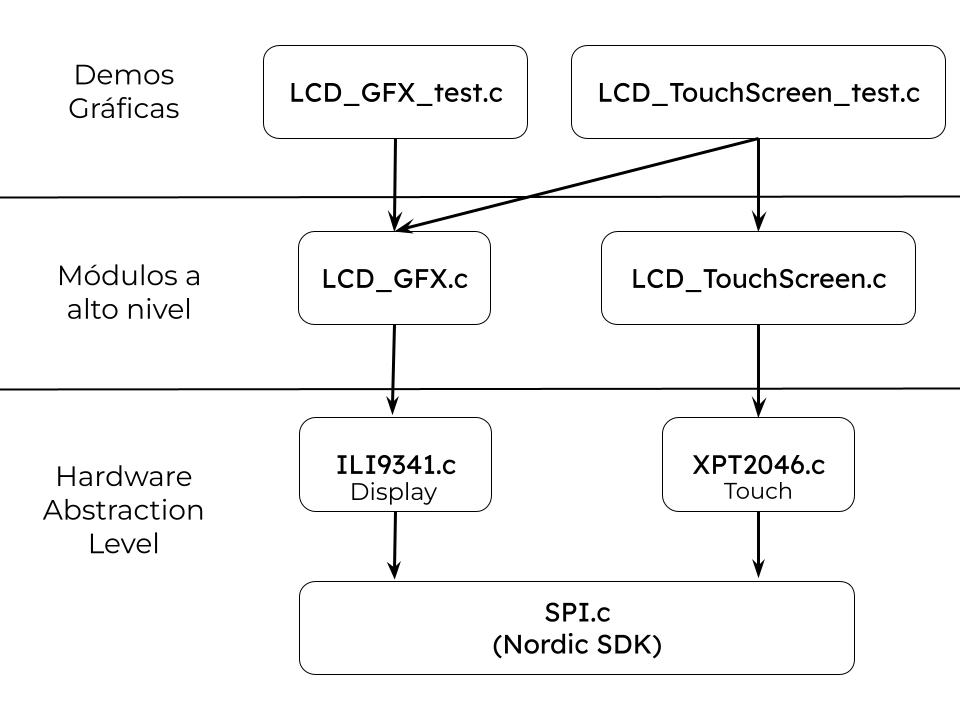

# Graphic Display Libraries — LSE 2025

**Author**: Jorge Fernández Marín  
**GitHub**: `@jofmar00`  
**Date**: 12-06-2025

---

## Software Architecture

The display graphic libraries are structured into three abstraction layers, as illustrated below:

### 1. Hardware Abstraction Level (HAL)

These modules communicate directly with the underlying hardware at register level via the SPI communication protocol. They rely on the `SPI.c` module, which has been obtained from the official Nordic SDK.

The HAL modules expose basic low-level functions, such as drawing a single pixel on the screen. These functions serve as building blocks for higher-level modules, allowing them to operate without dealing directly with hardware details.

- **`ILI9341.c`**:
    This module implements the driver for the ILI9341 display controller. It handles communication with the display hardware over SPI, providing functions to set individual pixels, send commands, and control the display initialization and configuration.

- **`XPT2046.c`**:
    This module implements the driver for the XPT2046 touchscreen controller. It communicates with the touch controller over SPI and provides raw touch position data, reading the (x, y) coordinates with a 12-bit resolution. The raw data can be calibrated and scaled for use by higher-level modules.

### 2. High-Level Modules

These modules provide more advanced functionalities built on top of the HAL modules. They are the main interface for developers.

- **`LCD_GFX.c`**:  
  This module provides graphical functions to draw various objects on the screen: squares, circles, text, images, etc. It uses a coordinate system `(x, y)` whose origin `(0,0)` depends on the current screen rotation, meaning that rotation affects the interpretation of coordinates. Each function that writes to the display should explicitly set its intended rotation to avoid inconsistencies.

- **`LCD_TouchScreen.c`**:  
  This module offers functions to detect touch points and pressure on the screen. The touch controller `XPT2046` returns raw touch coordinates `(x, y)` in the range `[0, 4095]`. Since the display resolution is `320×240` pixels, these raw values must be mapped to screen coordinates using calibration constants `MIN_X`, `MIN_Y`, `MAX_X`, and `MAX_Y`, defined in `LCD_TouchScreen.h`. These constants can be adjusted to improve touchscreen accuracy.

### 3. Graphic Demos

Small demonstration programs are provided to both validate touchscreen functionality and serve as usage examples for the high-level modules.  

- **`LCD_GFX_test.c`**:
  This module showcases the graphics functionalities provided by `LCD_GFX.c`. It includes examples of drawing basic shapes, text, and images on the display, demonstrating how to use the graphical primitives exposed by the high-level graphics module.

- **`LCD_TouchScreen_tes.c`**:
    This module illustrates how to interact with the touchscreen using the `LCD_TouchScreen.c` module. It includes examples of reading touch coordinates and processing user input. The demo also combines both touch and graphics functionality to create interactive drawing applications.

